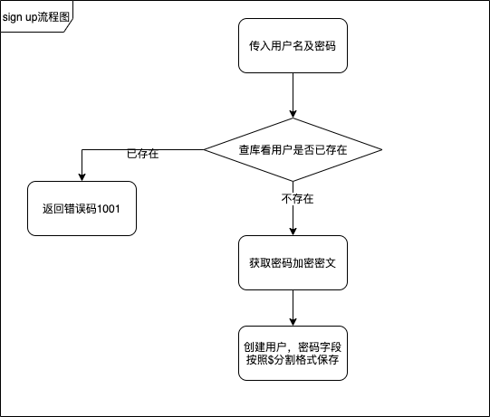
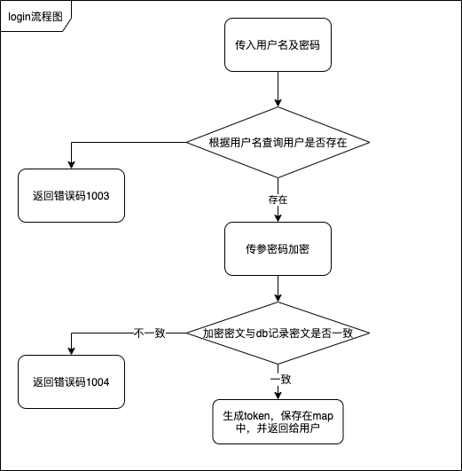
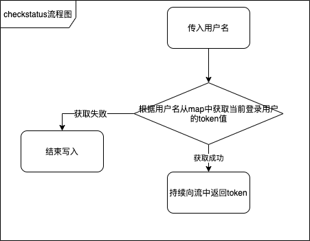
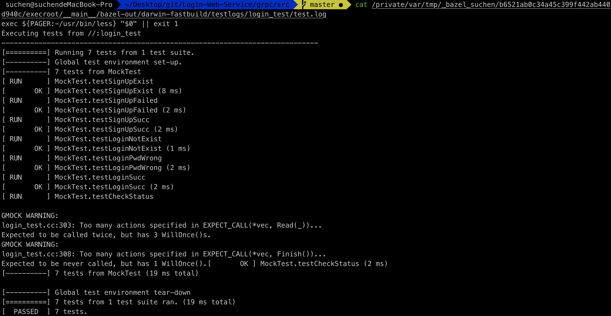

- [题目](#题目)
- [运行环境](#运行环境)
- [方案设计](#方案设计)
  - [模块设计](#模块设计)
  - [安全性设计](#安全性设计)
  - [单元测试](#单元测试)
- [运行命令](#运行命令)


## 题目

设计单终端登录系统，具备：
* 注册登录功能，单终端登录
* 使用`C++`+`grpc`实现，数据存储使用`mysql`，注意数据安全与传输安全

## 运行环境

```
OS: MacOS 10.15.5

Bazel: 3.3.0-homebrew

gcc: Apple clang version 11.0.3 (clang-1103.0.32.62)

docker: 19.03.8

mysql-client: 5.7
```

## 方案设计

### 模块设计

系统主要分为两个模块：

1. 命令行客户端：启动后用于发送注册、登录、持续检查登录状态等功能
2. 服务端：接收客户端请求，与数据库进行交互，提供注册、登录、单终端登录校验等接口


注册接口流程图如下所示

 

登录接口流程图如下所示

 

登录校验接口流程图如下所示

 


* 用户登陆成功，server端会返回一个token值，同时根据username做key保存在map中，当有其他终端登录，则覆盖token；用户登陆成功后，根据用户名请求登录校验接口，server端持续返回对应token，客户端获取到token进行对比，不一致则断开连接

本机环境下操作录屏：
https://v.youku.com/v_show/id_XNDczNjMzMDE1Mg==.html


1. 数据库连接模块
   数据库连接部分， 在mac环境下启动时遇到过一个问题，找不到安装之后的mysql-client库，查过资料，原因可能是由于mac环境下启动扫描的是xcode安装路径，而不是从/usr路径下扫描依赖，解决方案一个可以在xcode对应路径下创建软连接，这里采用的是另一种较为简单粗暴的方案，就是把dylib文件与对应头文件放在项目路径下


### 安全性设计

1. 数据安全：
   server端接到密码后，使用PBKDF2SHA1加密，salt值随机生成，并迭代10000次，得到密文，db中保存格式为： `PBKDF2SHA1$10000$salt$cypher_text`

2. 传输安全：
   传输安全方面，使用grpc + ssl，保证了数据传输的安全性，证书与密钥生成脚本见`generate_ca.sh`

3. 遇到的问题及解决方案：
   
   最初在使用`SslServerCredentials`建立连接的时候，启动服务端会报错："Invalid cert chain file."，需要确认两处：
   
   1. 生成密钥的脚本文件里，-subj后边的参数中，CN项的值需要与代码中客户端与服务端的地址完全一致，如果是localhost，就必须全部是localhost，否则会出错
   2. 确认过之后如果还报错，多半是密钥加载路径有问题（曾在这里卡了很久），在输出了项目运行目录之后，发现与项目路径是不一致的，但其中会有静态文件的软连接在，需要在加载时写对相对路径

### 单元测试

1. 测试用例：
   一共写了7个测试用例，分别对应：注册用户名已存在、注册失败、注册成功、登录用户名不存在、登录密码错误、登录成功、校验登录状态等7个场景

2. 本机环境下测试结果：
  

3. 遇到的问题及解决方案：
   1. 关于cc_test与grpc_cc_test
      
      查阅过grpc官方项目的话可以发现除了bazel提供的原生`cc_test`以外，grpc还提供了封装之后的`grpc_cc_test`，其实底层也是cc_test，如果使用grpc_cc_test，在编译时可能会遇到某个config_setting块不存在的错误，例如mac环境是：`//:mac_x86_64`，这个在grpc根目录下的BUILD文件中定义的，所以使用grpc_cc_test的话，需要引入这些环境配置项，为了避免冗余，最终采用的是cc_test

   2. 关于报错：

      不论使用以上哪种，在mac环境下运行都可能会遇到这个报错信息：`illegal thread local variable reference to regular symbol __ZN9grpc_core7ExecCtx9exec_ctx_E for architecture x86_64`，在对应的cc_test块中添加`linkstatic = True`即可解决

## 运行命令
1. ${project}项目根目录下运行`docker-compose up`
2. `${project}/grpc/src`路径下运行`bazel run :login_server`启动服务端
3. `${project}/grpc/src`路径下运行`bazel run :login_client`启动客户端
4. `${project}/grpc/src`路径下运行`bazel test :login_test`运行单元测试